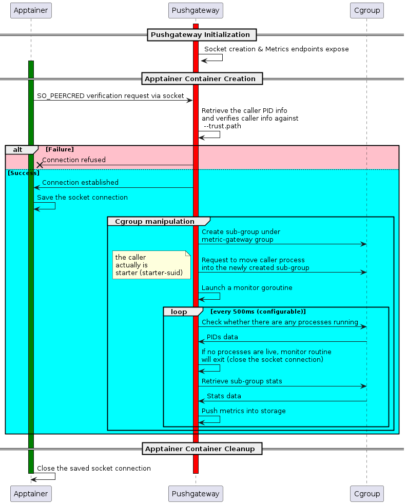

# Apptainer Monitoring Feature

## Background
To provide a unified way of collecting the Apptainer stats data. We plan to employ the cgroup feature, which requires putting starter (starter-suid) program under a created
sub cgroup, therefore, the cgroup stats can be collected and visualized.

To collect the cgroup stats, we are planning to employ and custormize the [Pushgateway](https://github.com/prometheus/pushgateway) tool, which allows ephemeral and batch jobs to expose their metrics to [Prometheus](https://prometheus.io/).

## Customized Pushgateway Features
1. Disabled the default push endpoints for security purpose, therefore, users can not directly push the data to pushgateway. Push can only be called via internal function calls.
2. Added a customized verification step, any incoming request through a unix socket will be verified (Check whether the process is trusted one).
3. The pushgateway can manipulate the cgroup and put the process into a newly created cgroup sub group, therefore can collect cgroup stat.
4. Moved /api/v1, /healthy, /ready to pull endpoints. All available endpoints are:
```
GET /api/v1/metrics
GET /api/v1/status
GET /metrics
GET /healthy
GET /ready
```

## Workflow

> Note that Pushgateway should be started with privileges, which means the unix socket created by Pushgateway is also privileged, so during the implementation, the permission of this newly created unix socket is changed to `0o777`, that is also the reason why we need to do additional security check, i.e., checking whether the program is trusted.


